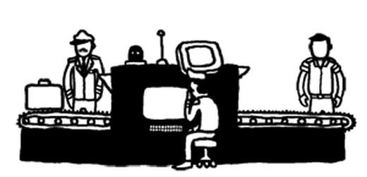
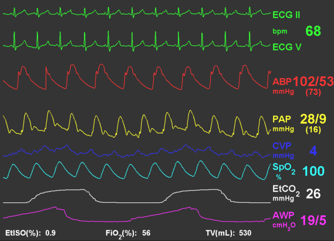

## PIGEON: Practical Investigation of Genomic Errors by Observation and Notification

  

> ## The problem is that genome sequencing data is still only understandable by professionals.   
> - ### Take Thalassemia for example, which has well-established causal genes. There is still no good tool for us to screen for mutations, conveniently and reliably.
> - ### Although there is a preprint [NGS4THAL, a one-stop molecular diagnosis and carrier screening tool for thalassemia and other hemoglobinopathies by next-generation sequencing](https://www.researchsquare.com/article/rs-542196/v1), I personally feel that it is still not user-friendly nor practically adoptable to be a "one-stop" tool, yet.

> - ### I don't feel comfortable to use its [Realign_BAM](https://github.com/JavenCao) module, since alignment tools including BWA and GATK have been used by the international community for so long and are continuously getting improved.
> - ### The [Talored_SV](https://github.com/JavenCao) module is not easy to implement or robust either. It is simply a combination of a bunch of existing black-box SV tools. 

> - ### Instead, we need to build something transparent and usable so that public health practitioners could get better involved in screening for genetic mutations for thalassemia, we need a system like that used for security check in the airport.
> - ### In the airport security check system, the luggage (analogy for genome) is put on a rotating belt, an automatic system is in place to visualize what is inside and send an alert when it detects something suspicious. Then, security staff (analogy for public health practitioners or genetic counselors) could manually examine by openning the luggage and poking things around.

> - ### Similary, the core philosophy of PIGEON is that it enables "manual observation" (by security staff) and "automatic notification" (by computational algorithm). 
> - _During the old war time, Pigeon has been used to deliver secret messages. In the modern era, Pigeon is a symbol for peace. Bringing secret genomic result to potential patients, and also give them a peaceful mind (for family planing for example), is the mission of the PIGEON system that we are going to develop._

    

     